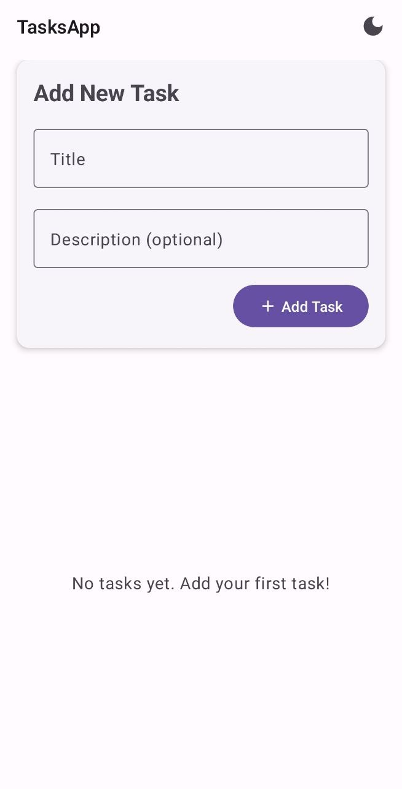
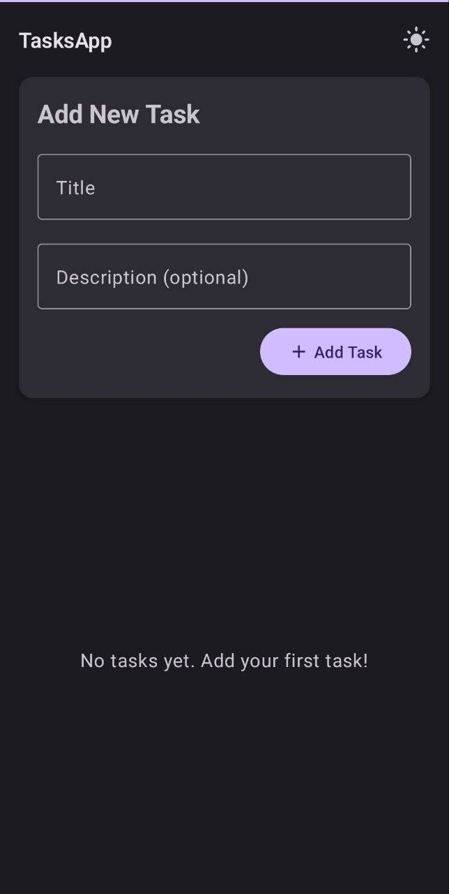
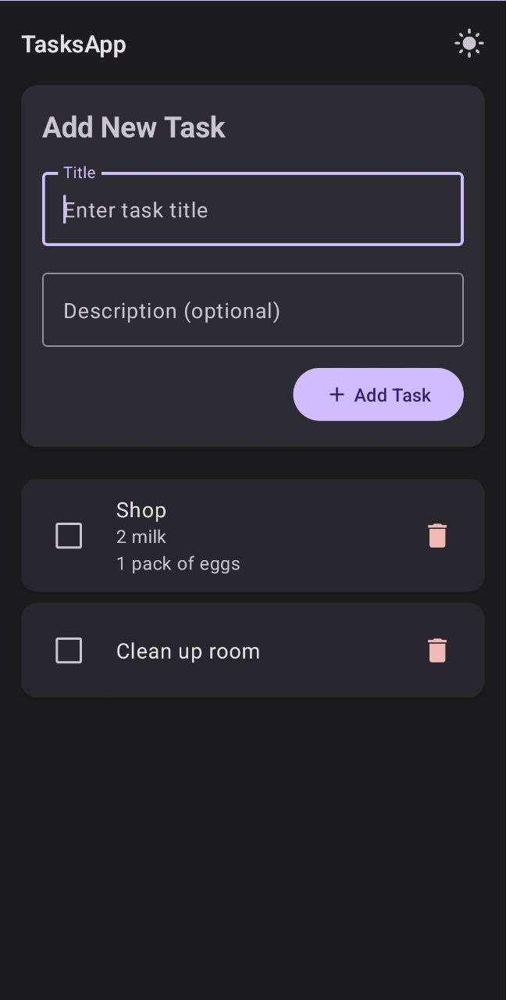
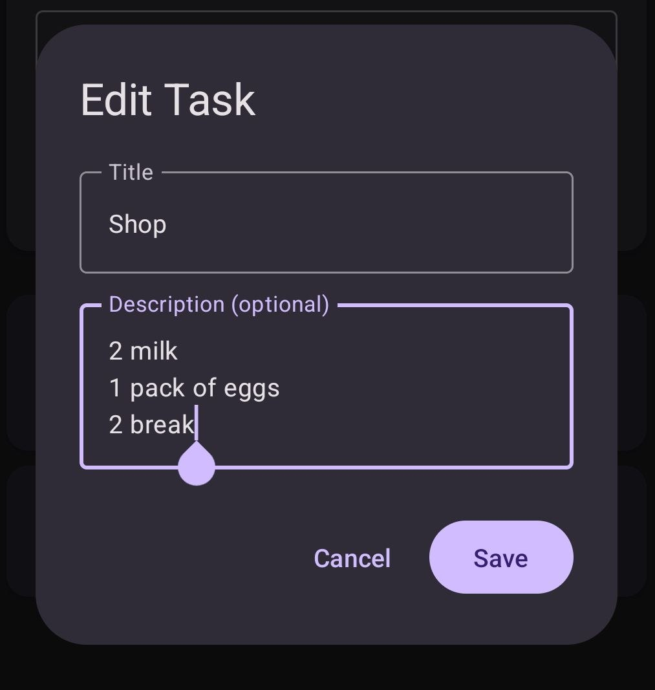
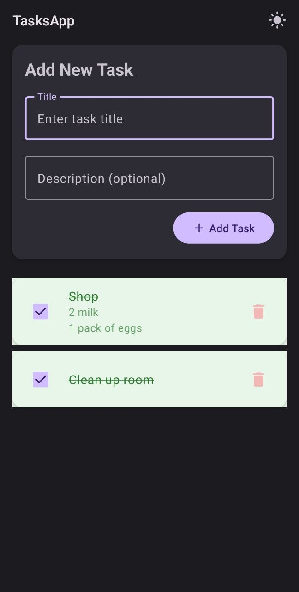

# tasks-android-app

- Простое приложение для Android, позволяющее управлять списком задач.
- Пользователь может создавать, редактировать и удалять задачи.
- Поддерживает светлую и тёмную темы, адаптивный интерфейс.

# Showcase

## Светлая и темная тема

| Светлая тема | Темная тема |
|--------------|-------------|
|  |  |

## Список задач

## Редактирование задачи

## Завершённые задачи

---

## License

This project is licensed under the MIT License. See the [LICENSE](./LICENSE) file for details.
